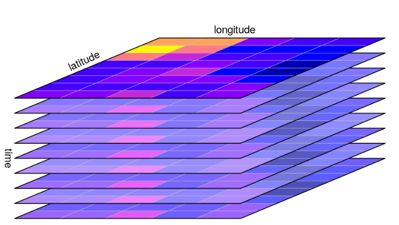

```{r setup, include=FALSE}
knitr::opts_chunk$set(echo = TRUE)
```

The below code is applied to a 31x31 (row x col) square raster with 240 layers. 

### 1.0 Install the Required Libraries

```{r,comment=NA,message=FALSE,warning=FALSE}
library(terra)
library(dplyr) #facilitates the use of %>% operator
library(tidyverse)
library(ggplot2)
```


### 2.0 Import NetCDF(nc) or tif files.

In this case, NetCDF files are used and are imported as follows.

Precipitation:
```{r,comment=NA,message=FALSE,warning=FALSE}
pr_rcp45 <- terra::rast("Test_data/rcm_outputs/rcp45/pr/2030/ENSEMBLE_MEAN/pr_EUR-11_ENSEMBLE-MEAN_historical_rcp45_2020-2039.nc")
pr_rcp45
```

Visualizing the first layer of precipitation.
```{r,comment=NA,message=FALSE,warning=FALSE}
p1 <- pr_rcp45[[1]]
plot(p1)
#summary(values(pr_rcp45)) - can obtain a summary of all the values in the layers
#values(pr_rcp45) - This is an array 
```


Maximum Temperature:
```{r,comment=NA,message=FALSE,warning=FALSE}
tasmax_rcp45 <- terra::rast("Test_data/rcm_outputs/rcp45/tasmax/2030/ENSEMBLE_MEAN/tasmax_EUR-11_ENSEMBLE-MEAN_historical_rcp45_2020-2039.nc")
tasmax_rcp45
```


Minimum Temperature:
```{r,comment=NA,message=FALSE,warning=FALSE}
tasmin_rcp45 <- terra::rast("Test_data/rcm_outputs/rcp45/tasmin/2030/ENSEMBLE_MEAN/tasmin_EUR-11_ENSEMBLE-MEAN_historical_rcp45_2020-2039.nc")
tasmin_rcp45

```


Average Temperature:
```{r,comment=NA,message=FALSE,warning=FALSE}
tasavg_rcp45 <- (tasmax_rcp45 + tasmin_rcp45)/2 
tasavg_rcp45
```


Suppose you have tif files, the code to import tif files using the terra package is as follows:

*`Pr1 <- terra::rast("file_location/xyz1.tif")`*
*`Max_temp <- terra::rast("file_location/xyz2.tif")`*
*`Min_temp <- terra::rast("file_location/xyz3.tif")`*

### 3.0 Julian day calculation

Note that all the above SpatRasters have the same "time" component. Let's extract this component.

```{r,comment=NA,message=FALSE,warning=FALSE}
time <- time(tasmin_rcp45) # Type = "Date"
#class(time)
head(time,50) #View the first 50 values of the variable "time" 

```


Calculating the Julian days as follows: 

Julian days simply is the number of days since the end of the previous year.
Ex: The Julian days for "2020-01-16", is the number of days to this date from "2019-12-31", which is 16 days.

```{r,comment=NA,message=FALSE,warning=FALSE}

# Calculate the number of days since the start of the current year:
prior_year <- year(time)-1 
head(prior_year,10) #View the first 10 values of the variable "prior_year" 
```

```{r,comment=NA,message=FALSE,warning=FALSE}
tail(prior_year,10) #View the last 10 values of the variable "prior_year" 
```


```{r,comment=NA,message=FALSE,warning=FALSE}
end.of.prior_year <- as.Date(paste0(prior_year, "-12-31")) 
head(end.of.prior_year,10)
```


```{r,comment=NA,message=FALSE,warning=FALSE}
tail(end.of.prior_year,10) #View the last 10 values of the variable "end.of.prior_year" 
```


\leavevmode
\newline 

```{r,comment=NA,message=FALSE,warning=FALSE}

Julian_days <- time - end.of.prior_year #In the variable "Julian days" leap years are accounted for 
Julian_days <- as.vector(Julian_days) #Convert into a vector
Julian_days
```

\vspace{30mm}

Suppose you are using tif files, you may have to initially create a vector in the above manner.


### 4.0 Extract the relevant Longitude and Latitude as vectors.


```{r,comment=NA,message=FALSE,warning=FALSE}
# Get the cell numbers
cell_no <- 1:ncell(tasmin_rcp45) #row-wise fashion
head(cell_no,15)
tail(cell_no,5) #31*31 = 961
```
```{r,comment=NA,message=FALSE,warning=FALSE}
# Get the latitudes corresponding to the cell numbers
lat <- yFromCell(tasmin_rcp45, cell_no) 
lat <- as.vector(lat)
# Print first 50 values
head(lat,50)
```


```{r,comment=NA,message=FALSE,warning=FALSE,echo=FALSE}

```


```{r,comment=NA,message=FALSE,warning=FALSE}

# Get the longitudes corresponding to the cell numbers
lon <- xFromCell(tasmin_rcp45, cell_no)
lon <- as.vector(lon)
# Print first 50 values:
head(lon,50) #Repetition of the 31 values can be observed

```


### 5.0 Calculating Modified Hargreaves reference ET

#### 5.1 Step 1: Supporting Equations

$$
Gsc = 0.082 \\
jd = Julian \ days \\
\text{Lat}_{\text{rad}} = (pi/180) * Lat \\
dr = 1+0.033*COS(2*(pi/365)*jd) \\
d = 0.409*SIN(2*(pi/365)*jd-1.39) \\
ws = ACOS(-TAN(\text{Lat}_{\text{rad}})*TAN(d)) \\
$$


```{r,eval=TRUE,comment=NA,message=FALSE,warning=FALSE}
Gsc <- 0.082 ; Gsc
```


```{r,eval=TRUE,comment=NA,message=FALSE,warning=FALSE}
jd <- Julian_days ; head(jd,5) #vector
```

Creating a Spatraster for Lat_rad.
```{r,eval=TRUE,comment=NA,message=FALSE,warning=FALSE}
Lat_rad <- (pi/180)*lat 


# Get dimensions of tasmin_rcp45
dims <- c(ncol(tasmin_rcp45), nrow(tasmin_rcp45),  1)

# Create an empty SpatRaster with the same dimensions as tasmin_rcp45
Lat_spatraster <- rast(
  ncol = dims[1],
  nrow = dims[2],
  nlyr = dims[3],
  xmin = ext(tasmin_rcp45)[1],
  xmax = ext(tasmin_rcp45)[2],
  ymin = ext(tasmin_rcp45)[3],
  ymax = ext(tasmin_rcp45)[4],
  crs = crs(tasmin_rcp45)
)

# Fill the empty SpatRaster with elements from Lat_rad
values(Lat_spatraster) <- Lat_rad 
print(Lat_spatraster)

#Lat_spatraster[1, 1, 1] - can obtain the row, col, layer value.

```

Create dr vector.
```{r,eval=TRUE,comment=NA,message=FALSE,warning=FALSE}
dr <- 1 + 0.033*cos(2*(pi/365)*jd) ; head(dr,5) #vector
```

Create d vector.
```{r,eval=TRUE,comment=NA,message=FALSE,warning=FALSE}
d <- 0.409*sin( (2*(pi/365)*jd) - 1.39 ) ; head(d,5) #vector
```


```{r,eval=TRUE,comment=NA,message=FALSE,warning=FALSE}

dims <- c(ncol(tasmin_rcp45), nrow(tasmin_rcp45),  length(d))

# Create an empty SpatRaster with the same extent and resolution 
ws_spatraster <- rast(
  ncol = dims[1],
  nrow = dims[2],
  nlyr = dims[3],
  xmin = ext(tasmin_rcp45)[1],
  xmax = ext(tasmin_rcp45)[2],
  ymin = ext(tasmin_rcp45)[3],
  ymax = ext(tasmin_rcp45)[4],
  crs = crs(tasmin_rcp45)
)


# Loop through each value in vector d
for (i in seq_along(d)) {
  WS <- acos(-tan(Lat_spatraster) * tan(d[i]))

  # Assign the result to the corresponding layer
  ws_spatraster[[i]] <- WS
  
  # Set layer names based on i
  names(ws_spatraster)[i] <- paste("lyr", i, sep = ".")
}

# Print the created SpatRaster
print(ws_spatraster)
```


#### 5.2 Step 2: Equations for Radiation(Ra_MJ):


$$
Ra_{\text{MJ}} = \frac{24 \times 60}{\pi} \cdot Gsc \cdot dr \cdot \left(ws \cdot \sin(\text{Lat}_{\text{rad}}) \cdot \sin(d) + \cos(\text{Lat}_{\text{rad}}) \cdot \cos(d) \cdot \sin(ws)\right)
$$


For step 1 a vector(1D) is obtained.
$$
Step\space 1 = \frac{24 \times 60}{\pi} \cdot Gsc \cdot dr
$$


```{r,eval=TRUE,comment=NA,message=FALSE,warning=FALSE}
step1 <- ((24*60)/pi)*Gsc*dr
```


From step 2 an array(3D) is obtained.
$$
Step \space 2 = ws  \cdot \sin(d) \cdot \sin(\text{Lat}_{\text{rad}}) \\\
\space \space   = k1 \cdot \sin(\text{Lat}_{\text{rad}}) 
$$
```{r,eval=TRUE,comment=NA,message=FALSE,warning=FALSE}

dims <- c(ncol(tasmin_rcp45), nrow(tasmin_rcp45),  length(d))

# Create an empty SpatRaster with the same extent and resolution 
k1_spatraster <- rast(
  ncol = dims[1],
  nrow = dims[2],
  nlyr = dims[3],
  xmin = ext(tasmin_rcp45)[1],
  xmax = ext(tasmin_rcp45)[2],
  ymin = ext(tasmin_rcp45)[3],
  ymax = ext(tasmin_rcp45)[4],
  crs = crs(tasmin_rcp45)
)

for (i in seq_along(d)) {
  # Multiply the i-th layer of k1_spatraster by the i-th element of sin(d)
  k1_spatraster[[i]] <- ws_spatraster[[i]] * sin(d[i])
  
  # Set layer names based on i
  names(k1_spatraster)[i] <- paste("lyr", i, sep = ".")
}

# Print the created SpatRaster k1_spatraster
print(k1_spatraster)

```


```{r,eval=TRUE,comment=NA,message=FALSE,warning=FALSE}

dims <- c(ncol(tasmin_rcp45), nrow(tasmin_rcp45),  length(d))

# Create an empty SpatRaster with the same extent and resolution 
step2_spatraster <- rast(
  ncol = dims[1],
  nrow = dims[2],
  nlyr = dims[3],
  xmin = ext(tasmin_rcp45)[1],
  xmax = ext(tasmin_rcp45)[2],
  ymin = ext(tasmin_rcp45)[3],
  ymax = ext(tasmin_rcp45)[4],
  crs = crs(tasmin_rcp45)
)

# Step 2: Loop through each layer of k1_spatraster and multiply by sin(Lat_spatraster)
for (k in seq_len(nlyr(k1_spatraster))) {
  k1_layer <- k1_spatraster[[k]]
  Lat_layer <- Lat_spatraster[[1]]  

  # Multiply each element by sin(Lat_spatraster)
  step2_layer <- k1_layer * sin(Lat_layer)

  # Assign the result to the corresponding layer
  step2_spatraster[[k]] <- step2_layer
  
  # Set layer names based on k
  names(step2_spatraster)[k] <- paste("lyr", k, sep = ".")
}

# Print the created SpatRaster step2_spatraster
print(step2_spatraster)

```


For step 3 an array(3D) is obtained.
$$
Step \space 3 = \sin(ws) \cdot \cos(d) \cdot \cos(\text{Lat}_{\text{rad}}) \\
= k2 \cdot \cos(\text{Lat}_{\text{rad}}) 
$$


```{r,eval=TRUE,comment=NA,message=FALSE,warning=FALSE}
dims <- c(ncol(tasmin_rcp45), nrow(tasmin_rcp45),  length(d))

# Create an empty SpatRaster with the same extent and resolution 
k2_spatraster <- rast(
  ncol = dims[1],
  nrow = dims[2],
  nlyr = dims[3],
  xmin = ext(tasmin_rcp45)[1],
  xmax = ext(tasmin_rcp45)[2],
  ymin = ext(tasmin_rcp45)[3],
  ymax = ext(tasmin_rcp45)[4],
  crs = crs(tasmin_rcp45)
)

for (i in seq_along(d)) {
  # Multiply the i-th layer of k2_spatraster by the i-th element of cos(d)
  k2_spatraster[[i]] <- sin(ws_spatraster[[i]]) * cos(d[i])
  
  # Set layer names based on i
  names(k2_spatraster)[i] <- paste("lyr", i, sep = ".")
}

# Print the created k2_spatraster
print(k2_spatraster)

```


```{r,eval=TRUE,comment=NA,message=FALSE,warning=FALSE}

dims <- c(ncol(tasmin_rcp45), nrow(tasmin_rcp45),  length(d))

# Create an empty SpatRaster with the same extent and resolution 
step3_spatraster <- rast(
  ncol = dims[1],
  nrow = dims[2],
  nlyr = dims[3],
  xmin = ext(tasmin_rcp45)[1],
  xmax = ext(tasmin_rcp45)[2],
  ymin = ext(tasmin_rcp45)[3],
  ymax = ext(tasmin_rcp45)[4],
  crs = crs(tasmin_rcp45)
)

# Step 2: Loop through each layer of k2_spatraster and multiply by cos(Lat_spatraster)
for (k in seq_len(nlyr(k2_spatraster))) {
  k2_layer <- k2_spatraster[[k]]
  Lat_layer <- Lat_spatraster[[1]]  # Lat_spatraster is a single layer SpatRaster

  # Multiply each element by cos(Lat_spatraster)
  step3_layer <- k2_layer * cos(Lat_layer)

  # Assign the result to the corresponding layer
  step3_spatraster[[k]] <- step3_layer
  
  # Set layer names based on k
  names(step3_spatraster)[k] <- paste("lyr", k, sep = ".")
}

# Print the created step3_spatraster
print(step3_spatraster)

```


Calculating Ra_MJ a 3D array:


$$
Ra_{\text{MJ}} = Step\space 1 \cdot (Step\space 2 + Step\space 3) \\
= Step\space 1 \cdot   \text{int_step} 
$$

```{r,eval=TRUE,comment=NA,message=FALSE,warning=FALSE}
int_step <- (step2_spatraster + step3_spatraster)
Ra_MJ <- step1*int_step
print(Ra_MJ)
```


#### 5.3 Step 3: Equations for Radiation(Ra):

$$
Ra = Ra_{\text{MJ}} \cdot 0.408 \\
Ra_{\text{MJ}} = \text{Radiation in Mega-joules per square meter per day} \, [MJ \, m^{-2} \, d^{-1}]
$$


Calculating Ra a 3D array:

```{r,eval=TRUE,comment=NA,message=FALSE,warning=FALSE}
Ra <- Ra_MJ*0.408 
print(Ra)

```


#### 5.4 Step 4: Equation for Evapotranspiration:


Calculate modified Hargreaves Mod_ET_0 a 3D array:

$$
{\text Mod\_ET_0} = 0.0013 \cdot Ra \cdot (T_{\text{mean}} + 17.0) \cdot ((T_{\text{max}} - T_{\text{min}}) - 0.0123 \cdot P)^{0.76} \\
= Ra \cdot   \text{temp_pr} 
$$

```{r,eval=TRUE,comment=NA,message=FALSE,warning=FALSE}
temp_pr <- 0.0013*(tasavg_rcp45 + 17)*(((tasmax_rcp45 - tasmin_rcp45) - (0.0123*pr_rcp45))^0.76)
Mod_ET_0 <- Ra * temp_pr
print(Mod_ET_0)
```

Calculate Hargreaves ET_0 a 3D array:
$$
ET_0 = 0.0023  \cdot (T_{\text{mean}} + 17.8) \cdot (T_{\text{max}} - T_{\text{min}})^{0.50}\cdot Ra \\
$$


```{r,eval=TRUE,comment=NA,message=FALSE,warning=FALSE}
ET_0 <- 0.0023*(tasavg_rcp45 + 17.8)*((tasmax_rcp45 - tasmin_rcp45)^0.50)*Ra
print(ET_0)
```


### 6.0 Calculating AET.

$$
AET = P  \cdot [1 + PET/P - (1 + (PET/P)^{\omega})^{1 / \omega}] \\
\omega = 1.8
$$

```{r,eval=TRUE,comment=NA,message=FALSE,warning=FALSE}
AET = pr_rcp45*(1 + (Mod_ET_0/pr_rcp45) - (1 + (Mod_ET_0/pr_rcp45)^1.8)^{1/1.8})
print(AET)  
```


### 7.0 The already calculated and available ET_0 data.

```{r,eval=TRUE,comment=NA,message=FALSE,warning=FALSE}
PET_rcp45 <- terra::rast("Test_data/PET/cordex_era/rcp45/2030/eto_EUR-11_ENSEMBLE-MEAN_rcp45_2020-2039_MONMEAN.nc")
PET_rcp45 
```


